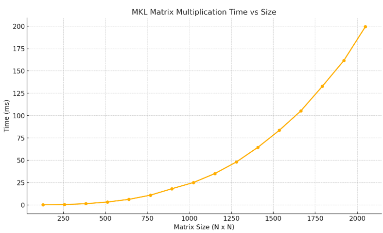
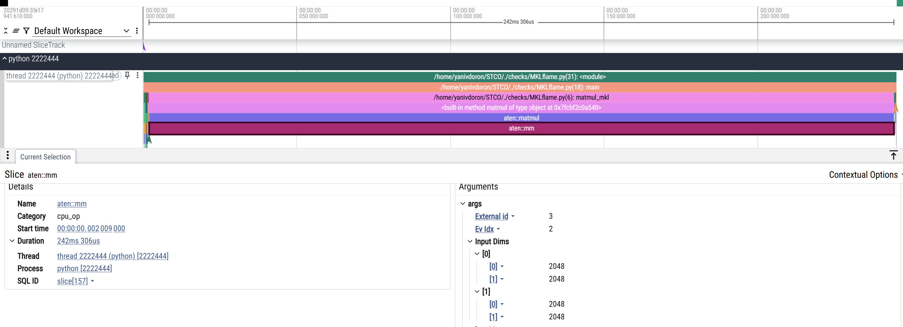

# 🧠 Optimized CPU Matrix Multiplication (Intel MKL Reference)

## 📌 Overview

This module serves as the **CPU-side reference baseline** for performance comparisons in our matrix multiplication project.  
It uses **Intel’s Math Kernel Library (MKL)** to perform high-performance dense matrix multiplication.

Intel MKL is a highly optimized, multithreaded library specifically engineered for numerical computations on modern CPUs.  
By leveraging MKL, we can approach peak CPU performance **without** manually writing low-level SIMD or multithreaded code.

---

## ⚙️ Why Intel MKL?

Intel MKL provides architecture-aware optimizations across multiple dimensions:

### ✅ Key Features:

- **Multithreading**  
  MKL automatically parallelizes matrix multiplication across all available CPU cores using efficient internal threading mechanisms.

- **SIMD Vectorization**  
  Uses modern vector instruction sets (e.g., AVX2, AVX-512) to compute multiple elements in parallel within each core.

- **Cache-Aware Blocking**  
  Implements intelligent tiling strategies that optimize data reuse across L1/L2/L3 cache levels, reducing memory access latency.

- **NUMA Awareness**  
  On multi-socket systems, MKL minimizes memory access latency by scheduling threads and memory allocations according to NUMA topology.

- **Highly Tuned Assembly Kernels**  
  Intel engineers provide hand-optimized assembly routines that outperform compiler-generated code, yielding near-hardware-limit performance.

---

## 🧪 Usage as Benchmark

In our project, the MKL implementation is used to:

- Establish a **CPU performance baseline** for matrix multiplication.
- Compare and quantify the **performance gains** achieved by our GPU-based CUDA kernels.

---

---
# 📊 Running and Profiling the Matrix Multiplication Implementation

This section explains how to run, profile, and visualize the performance of the different matrix multiplication implementations included in this project. Each script below plays a specific role in benchmarking GPU and CPU performance, generating visual output, and saving logs for analysis.

---

## 🔧 Scripts Overview

| Script                   | Description                                                                 |
|--------------------------|-----------------------------------------------------------------------------|
| `Benchmark.py`           | Benchmarks all GPU matmul methods and saves their runtime + speedup data   |
| `GenerateFlameGraph.py`  | Profiles a single GPU implementation and generates a Chrome trace timeline |
| `ShowPerformance.py`     | Loads benchmark data and plots performance/speedup graphs                  |
| `script_benchmark_MKL.sh`| Benchmarks CPU MKL-based matmul and saves the results                      
