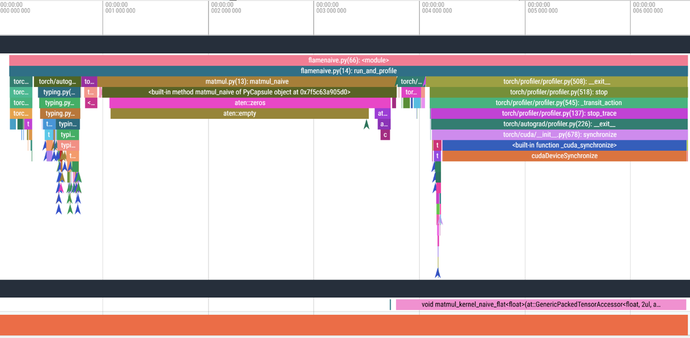

## ⚡ Naive CUDA Implementation

To establish a baseline for GPU acceleration benefits, we implemented a **naive CUDA kernel** that performs square matrix multiplication without using shared memory or register tiling.  
Each CUDA thread is assigned to compute a single output element in the result matrix.

Despite its simplicity, this naive kernel **consistently outperforms Intel MKL**, achieving up to **10.8× speedup** on large matrices (e.g., 1024×1024), thanks to the GPU’s inherent architectural advantages.

---

### ✅ Architectural Advantages of Naive CUDA:

- **Massive Parallelism**  
  Modern GPUs contain thousands of lightweight cores capable of executing threads concurrently.  
  Even a naive implementation (one thread per element) scales to thousands of threads — far beyond what even multicore CPUs with SIMD can offer.

- **High Memory Bandwidth**  
  GPUs typically offer an order-of-magnitude higher memory bandwidth than CPUs.  
  Even without using shared memory, the naive CUDA kernel benefits from fast global memory access.

- **Latency Hiding via Warp Scheduling**  
  While CPUs reduce latency using deep cache hierarchies, GPUs rely on warp-level context switching.  
  If one warp stalls due to memory access, another is scheduled — ensuring continuous execution.

- **Graceful Scaling with Matrix Size**  
  As matrix dimensions increase, GPU occupancy improves and the hardware becomes more fully utilized.  
  In contrast, CPUs often face cache and memory bottlenecks, leading to diminishing performance returns.

---

### 🧪 Benchmark Results

The naive kernel served as a second reference point (in addition to MKL).  
It enabled us to evaluate the impact of further GPU optimizations such as:

- Shared memory tiling  
- Register tiling  
- Thread cooperation within warps  
- Kernel streaming with multiple CUDA streams
  

  

    

      To evaluate the performance benefits of GPU acceleration, we implemented a Naive CUDA kernel for square matrix multiplication.
      Both methods were benchmarked across increasing matrix sizes, and the execution times were recorded using a performance counter.
    

    

      Despite its simplicity, the Naive CUDA version consistently outperformed MKL, achieving up to
      <strong>10.8× speedup</strong> on large matrices.
      This improvement stems from the GPU’s massive parallelism, higher memory bandwidth, and efficient latency hiding,
      making it significantly more effective for large-scale matrix computations.
    

  

  

    
  

The results show that even **naive GPU code** can outperform sophisticated CPU libraries when the GPU's compute and memory capabilities are effectively leveraged.

---

### 📌 Summary

This implementation highlights the **inherent strength of the GPU architecture**, showing that substantial performance gains can be achieved even before applying advanced memory or scheduling optimizations.

