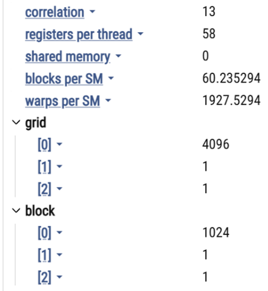

## ⚡ Naive CUDA Implementation

To establish a baseline for GPU acceleration benefits, we implemented a **naive CUDA kernel** that performs square matrix multiplication without using shared memory or register tiling.  
Each CUDA thread is assigned to compute a single output element in the result matrix.

Despite its simplicity, this naive kernel **consistently outperforms Intel MKL**, achieving up to **10.8× speedup** on large matrices (e.g., 1024×1024), thanks to the GPU’s inherent architectural advantages.

---

### ✅ Architectural Advantages of Naive CUDA:

- **Massive Parallelism**  
  Modern GPUs contain thousands of lightweight cores capable of executing threads concurrently.  
  Even a naive implementation (one thread per element) scales to thousands of threads — far beyond what even multicore CPUs with SIMD can offer.

- **High Memory Bandwidth**  
  GPUs typically offer an order-of-magnitude higher memory bandwidth than CPUs.  
  Even without using shared memory, the naive CUDA kernel benefits from fast global memory access.

- **Latency Hiding via Warp Scheduling**  
  While CPUs reduce latency using deep cache hierarchies, GPUs rely on warp-level context switching.  
  If one warp stalls due to memory access, another is scheduled — ensuring continuous execution.

- **Graceful Scaling with Matrix Size**  
  As matrix dimensions increase, GPU occupancy improves and the hardware becomes more fully utilized.  
  In contrast, CPUs often face cache and memory bottlenecks, leading to diminishing performance returns.

---

### 🧪 Benchmark Results

The naive kernel served as a second reference point (in addition to MKL).
Despite its simplicity, the Naive CUDA version consistently outperformed MKL, achieving up to
<strong>10.8× speedup</strong> on large matrices. This improvement stems from the GPU’s massive parallelism,
higher memory bandwidth, and efficient latency hiding, making it significantly more effective for large-scale matrix computations.


  ### 🔥 Flame Graph Analysis – Naive CUDA Kernel

The flame graph above visualizes the execution flow of a PyTorch program that invokes a naive CUDA-based matrix multiplication kernel.

The execution begins in `flamenaive.py` where the `run_and_profile()` function is called. This function in turn calls `matmul_naive` from `matmul.py`, which wraps the call to a custom CUDA extension function:  
`<built-in method matmul_naive of PyCapsule object at ...>`.

Before the kernel is launched, PyTorch allocates memory for output tensors using `aten::empty` and `aten::zeros`. The actual CUDA kernel — `void matmul_kernel_naive_flat<float>(...)` — is visible at the bottom of the graph, appearing later in the timeline due to PyTorch's **asynchronous execution** model. CUDA operations are enqueued but only executed on the device when required or explicitly synchronized.

The right side of the flame graph shows the **profiler shutdown and synchronization** logic:
- The profiler exits via `torch/profiler/profiler.py(...)`
- Device-side completion is enforced by `cudaDeviceSynchronize`, ensuring all GPU work is completed before profiling ends.

This structure is typical when analyzing performance-critical GPU code in PyTorch using `torch.profiler`, and it highlights the separation between host-side logic and actual GPU execution.


The results show that even **naive GPU code** can outperform sophisticated CPU libraries when the GPU's compute and memory capabilities are effectively leveraged.


<table>
<tr>
<td>
  
---
### ⚠️ Limitation of the Naive Kernel
---

In the naive implementation of CUDA matrix multiplication,
we configure a block with 1024 threads While this approach works
for small matrices it is not necessarily optimal in terms 
of GPU performance and resource utilization.

Limitation:
By running only one block, even if it uses the maximum number of
threads allowed per block (1024), we are still engaging just one SM.
This leads to low occupancy at the device level,
because the GPU is designed to run many blocks across many SMs in parallel.
Consequently, this single-block strategy becomes a bottleneck,
especially for larger or more complex computations

look at the next : [ Block-Wise Tiling](/3_Block_Wise_Tilling) for 


- Uses 1 block of 1024 threads → engages only 1 SM.  
- Low GPU occupancy.  
- Not scalable to large matrices.

</td>
<td>



</td>
</tr>
</table>

### 📌 Summary

This implementation highlights the **inherent strength of the GPU architecture**, showing that substantial performance gains can be achieved even before applying advanced memory or scheduling optimizations.
It enabled us to evaluate the impact of further GPU optimizations such as:

- Shared memory tiling  
- Register tiling  
- Thread cooperation within warps  
- Kernel streaming with multiple CUDA streams

# 📊 Running and Profiling the Matrix Multiplication Implementation

This section explains how to run, profile, and visualize the performance of the different matrix multiplication implementations included in this project. Each script below plays a specific role in benchmarking GPU and CPU performance, generating visual output, and saving logs for analysis.

---

## 🔧 Scripts Overview

| Script                   | Description                                                                 |
|--------------------------|-----------------------------------------------------------------------------|
| `Benchmark.py`           | Benchmarks the current method and show their runtime + speedup data         |
| `GenerateFlameGraph.py`  | Profiles a single implementation and generates a Chrome trace timeline      |
| `ShowPerformance.py`     | Profiles a single implementation and store the data on text file            |
| `script_benchmark_<X>.sh`| Benchmarks the current matmul against the previeus implementation           |                     

---

## 📊 `Benchmark.py`

Benchmarks the current matrix multiplication implementation across multiple matrix sizes.
compare to CPU-based matrix multiplication using Intel MKL and previeus implementation .
**What it does:**
- Runs current implementation
- Measures runtime and calculates speedups.

**Output:**
- `results/times.npy`: Runtimes (ms) for each method and size.
- `results/speedups.npy`: Speedup compared to baseline (e.g., MKL or naive).

**To run:**
```bash
python Benchmark.py
```
---
## 🔥 `GenerateFlameGraph.py`

Profiles a single kernel execution using torch.profiler and generates a Chrome-compatible trace.

Output:

log/profile.json: Timeline that can be loaded into chrome://tracing.

```bash
python GenerateFlameGraph.py
```

## 📄 `ShowPerformance.py`

Profiles a single kernel execution using torch.profiler and store the data on text file.

Output:
Profile.txt

```bash
python ShowPerformance.py
```

## 🧪 `script_benchmark_<X>.sh`
Benchmarks the current matrix multiplication implementation across multiple matrix sizes.
compare to CPU-based matrix multiplication using Intel MKL and previeus implementation .

What it does:

Runs cuurent GPU matrix multiplication across different sizes.

Records runtime and speedups plot to screen.

Output:

**Output:**
- `results/times.npy`: Runtimes (ms) for each method and size.
- `results/speedups.npy`: Speedup compared to baseline (MKL and previeus implementation  ).

```bash
bash script_benchmark_<X>.sh
```


