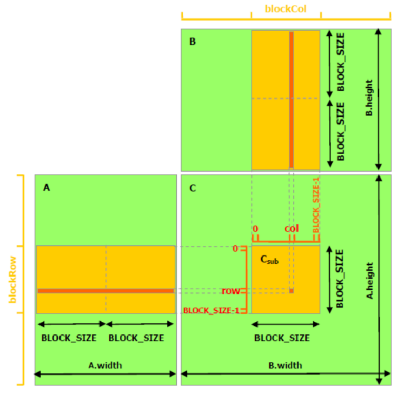
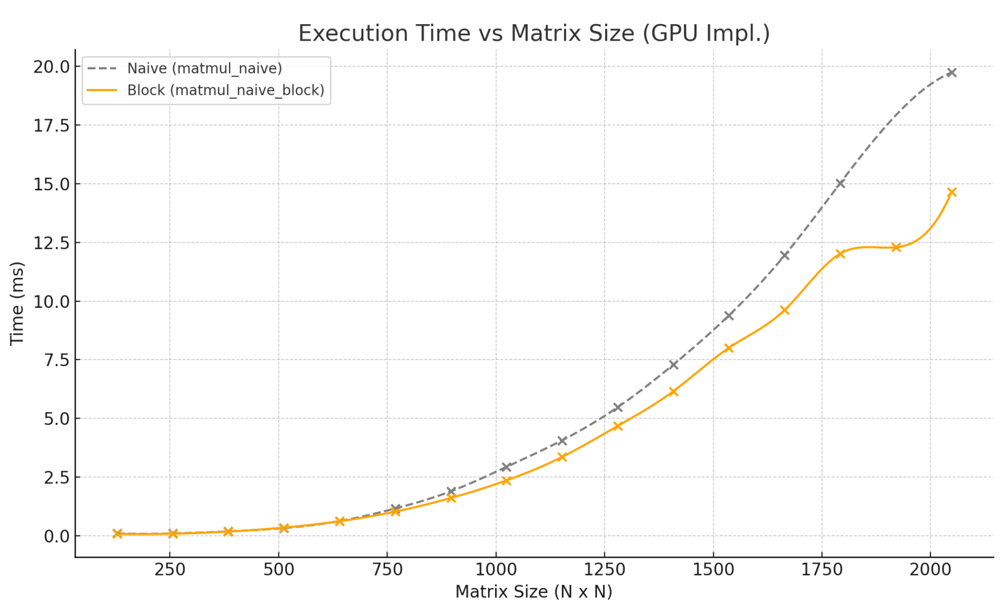
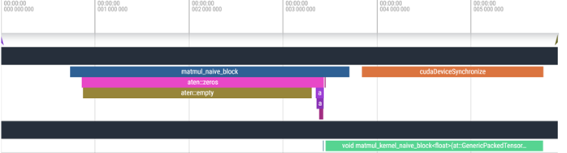
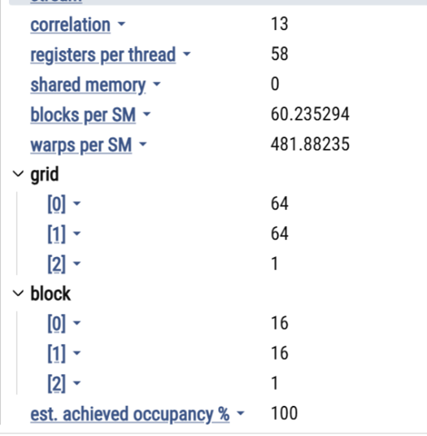

# 🧱 Block-Wise Tiling for GPU Parallelism

### Previous  : [Naive GPU Implementation](/2_Naive_GPU_Imp)                           Next  : [Streaming](/4_Streaming)                                            

 
<table>
<tr>
<td>
  

⚠️ In the naive implementation of CUDA matrix multiplication,
we configure a block with 1024 threads While this approach works
for small matrices it is not necessarily optimal in terms 
of GPU performance and resource utilization.

Limitation:
By running only one block, even if it uses the maximum number of
threads allowed per block (1024), we are still engaging just one SM.
This leads to low occupancy at the device level,
because the GPU is designed to run many blocks across many SMs in parallel.
Consequently, this single-block strategy becomes a bottleneck,
especially for larger or more complex computations

To address naive limitations, we implemented a **block-wise tiled CUDA kernel**, assigning a 16×16 thread block to each matrix tile.  
Each thread computes one output element — enabling **scalable**, **high-occupancy** GPU utilization.

</td>
<td>



</td>
</tr>
</table>


A better approach is to divide the work across multiple smaller blocks, each with dimensions like 16×16 (256 threads). These blocks can be distributed across multiple SMs, enabling concurrent execution and better throughput. This layout also aligns well with warp execution, improves load balancing, and makes the kernel more scalable to larger matrices.


### ✅ Improvements from Block-Wise Tiling

- 🧠 **More Blocks → More SMs Active**
- 🎯 **Better Warp Utilization (256 threads per block)**
- 📶 **Better Memory Coalescing**
- 🔁 **Scalable Across Matrix Sizes**

---

### 📊 Benchmark Results – Blocked CUDA

## 🧩 The Significance of Block-Wise Decomposition in CUDA Matrix Multiplication

### 🔹 When Matrices Are Small

For small matrices (e.g., 128×128 or 256×256), the performance difference between a **naive CUDA implementation** and a **block-wise tiled implementation** is modest. This is because:

- The GPU’s massive parallelism is **underutilized** in both cases.
- The entire matrix may fit in the **L1 or L2 cache**, reducing the penalty of unoptimized memory access.
- Launch overhead and thread divergence are minimal at small scales.

As a result, performance gains from blocking may be around **1.5× to 2×** over the naive version.

---

### 🔹 When Matrices Are Large

As matrix sizes grow (e.g., 1024×1024 and beyond), block-wise decomposition becomes **increasingly critical** for performance:

- The naive kernel assigns one thread per output element, causing **non-coalesced global memory accesses** and **redundant reads**.
- Larger matrices exceed cache capacity, making memory access latency a major bottleneck.
- Blocked kernels divide the work into **tiles** processed by cooperative thread blocks:
  - Data is loaded into **shared memory**, which is much faster than global memory.
  - **Data reuse** within each tile reduces redundant accesses.
  - **Memory coalescing** improves, increasing bandwidth efficiency.
  - Thread blocks achieve higher **occupancy** and better **load balancing**.

This leads to significantly better performance — often achieving **10× to 12× speedup** over the naive implementation.

---

### ⚡ Summary

| Matrix Size | Naive Kernel Performance | Blocked Kernel Performance | Key Difference |
|-------------|---------------------------|-----------------------------|----------------|
| Small       | Acceptable                | Slightly Better             | GPU underutilized |
| Large       | Poor (uncoalesced, slow)  | Excellent (tiled, efficient) | Memory reuse and locality |

---

Block-wise decomposition is essential for taking full advantage of the GPU architecture — especially for large matrices. It improves memory access patterns, reduces latency, and unlocks the parallel processing potential of CUDA.


| **Size** | **MKL (ms)** | **Naive (ms)** | **Block (ms)** | **Naive Speedup** | **Block Speedup** |
|----------|--------------|----------------|----------------|-------------------|-------------------|
| 128×128  | 0.123        | 0.102          | 0.077          | 1.20×             | 1.59×             |
| 256×256  | 0.534        | 0.099          | 0.084          | 5.40×             | 6.37×             |
| 512×512  | 3.900        | 0.330          | 0.349          | 11.83×            | 11.18×            |
| 1024×1024| 26.826       | 2.944          | 2.354          | 9.11×             | 11.40×            |
| 2048×2048| 201.054      | 18.137         | 15.945         | 11.09×            | 12.61×            |



---

### 🔥 Flame Graph – Block-Wise CUDA

Each block computes a matrix tile → multiple blocks across SMs = full device utilization.  
Memory latency is better hidden due to concurrency.




---
## 📌 Summary
The blocked CUDA implementation consistently outperforms both the MKL baseline and the naïve CUDA kernel across all matrix sizes. Starting from a modest gain at size 128×128 (1.59× speedup), the block kernel scales effectively with size, reaching up to 12.61× speedup at 2048×2048. This improvement is driven by better memory coalescing, reduced global memory traffic,  and improved parallelism, making it more efficient and scalable for large matrix multiplication tasks.

<table>
<tr>
<td>
  


| Feature                  | Naive CUDA                | Block-Wise CUDA            |
|--------------------------|---------------------------|----------------------------|
| Threads per block        | 1024                      | 256 (16×16)                |
| SM Utilization           | ❌ Low                    | ✅ High                    |
| Scalability              | ❌ Poor                   | ✅ Excellent               |
| Speedup vs MKL (max)     | ~11×                      | ~12.6×                     |

</td>
<td>
 



</td>
</tr>
</table>


---

## 📊 Running and Profiling the Matrix Multiplication Implementations

This section explains how to benchmark, profile, and analyze all GPU implementations in the project.

---

### 🔧 Scripts Overview

| Script                   | Description                                                                 |
|--------------------------|-----------------------------------------------------------------------------|
| `Benchmark.py`           | Benchmarks all implementations and prints speedup vs MKL                   |
| `GenerateFlameGraph.py`  | Runs profiler, saves Chrome timeline (log/profile.json)                    |
| `ShowPerformance.py`     | Runs profiler and saves tabular data to `Profile.txt`                      |
| `script_benchmark_<X>.sh`| Bash runner for specific kernels across matrix sizes                        |

---

### 📈 `Benchmark.py`

**What it does:**
- Runs all GPU matmul implementations on several matrix sizes.
- Compares performance to MKL and previous kernels.

**Output:**
- `results/times.npy`
- `results/speedups.npy`

**Usage:**
```bash
python Benchmark.py
