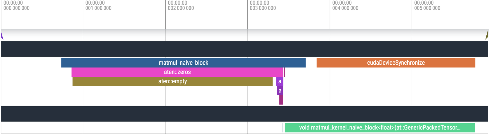

# 🧱 Block-Wise Tiling for GPU Parallelism

 
To address naive limitations, we implemented a **block-wise tiled CUDA kernel**, assigning a 16×16 thread block to each matrix tile.  
Each thread computes one output element — enabling **scalable**, **high-occupancy** GPU utilization.


A better approach is to divide the work across multiple smaller blocks, each with dimensions like 16×16 (256 threads). These blocks can be distributed across multiple SMs, enabling concurrent execution and better throughput. This layout also aligns well with warp execution, improves load balancing, and makes the kernel more scalable to larger matrices.


### ✅ Improvements from Block-Wise Tiling

- 🧠 **More Blocks → More SMs Active**
- 🎯 **Better Warp Utilization (256 threads per block)**
- 📶 **Better Memory Coalescing**
- 🔁 **Scalable Across Matrix Sizes**

---

### 📊 Benchmark Results – Blocked CUDA

| **Size** | **MKL (ms)** | **Naive (ms)** | **Block (ms)** | **Naive Speedup** | **Block Speedup** |
|----------|--------------|----------------|----------------|-------------------|-------------------|
| 128×128  | 0.123        | 0.102          | 0.077          | 1.20×             | 1.59×             |
| 256×256  | 0.534        | 0.099          | 0.084          | 5.40×             | 6.37×             |
| 512×512  | 3.900        | 0.330          | 0.349          | 11.83×            | 11.18×            |
| 1024×1024| 26.826       | 2.944          | 2.354          | 9.11×             | 11.40×            |
| 2048×2048| 201.054      | 18.137         | 15.945         | 11.09×            | 12.61×            |


---

### 🔥 Flame Graph – Block-Wise CUDA

Each block computes a matrix tile → multiple blocks across SMs = full device utilization.  
Memory latency is better hidden due to concurrency.



---

## 📌 Summary

| Feature                  | Naive CUDA                | Block-Wise CUDA            |
|--------------------------|---------------------------|----------------------------|
| Threads per block        | 1024                      | 256 (16×16)                |
| Number of blocks         | 1                         | (N / 16) × (N / 16)        |
| SM Utilization           | ❌ Low                    | ✅ High                    |
| Scalability              | ❌ Poor                   | ✅ Excellent               |
| Speedup vs MKL (max)     | ~11×                      | ~12.6×                     |

---

## 📊 Running and Profiling the Matrix Multiplication Implementations

This section explains how to benchmark, profile, and analyze all GPU implementations in the project.

---

### 🔧 Scripts Overview

| Script                   | Description                                                                 |
|--------------------------|-----------------------------------------------------------------------------|
| `Benchmark.py`           | Benchmarks all implementations and prints speedup vs MKL                   |
| `GenerateFlameGraph.py`  | Runs profiler, saves Chrome timeline (log/profile.json)                    |
| `ShowPerformance.py`     | Runs profiler and saves tabular data to `Profile.txt`                      |
| `script_benchmark_<X>.sh`| Bash runner for specific kernels across matrix sizes                        |

---

### 📈 `Benchmark.py`

**What it does:**
- Runs all GPU matmul implementations on several matrix sizes.
- Compares performance to MKL and previous kernels.

**Output:**
- `results/times.npy`
- `results/speedups.npy`

**Usage:**
```bash
python Benchmark.py
