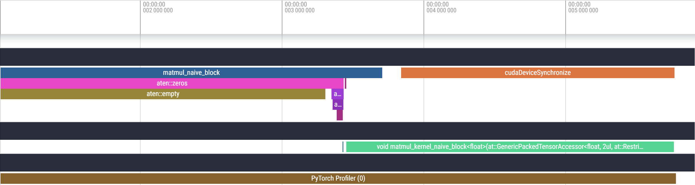
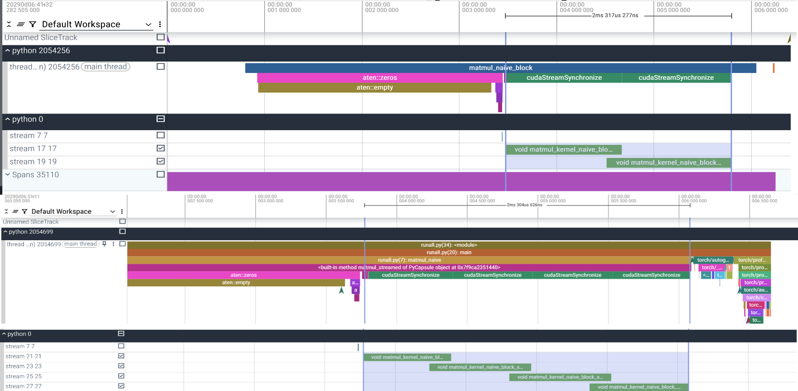
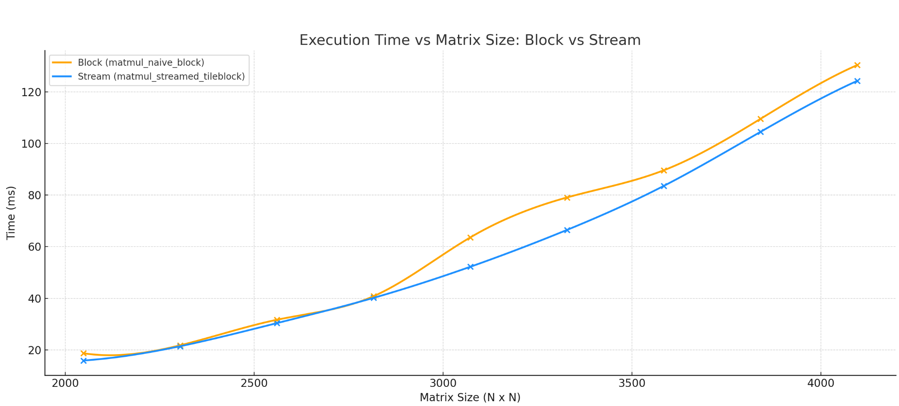

# 🏊🏼 Streaming-Based Overlap of Compute and Transfer

### Previous  : [Block Wise Tilling](/3_Block_Wise_Tilling)

### Next  : [Shared Memory](/5_Shared_Memory)    

## 🎯 Motivation: Underutilization in Sequential Kernel Launches

In typical CUDA workflows, kernel launches are often performed **sequentially** from a single default stream. This leads to the following problem:

- **Only one kernel runs at a time**, even if others are independent.
- As a result, **many Streaming Multiprocessors (SMs) sit idle**, especially during short or I/O-bound kernels.
- The GPU is **underutilized**, and total execution time increases due to poor concurrency.
  


To solve this, we apply **streaming**, which allows **concurrent kernel execution** by launching kernels across **multiple independent CUDA streams**.


## 🔄 Stream-Based Execution in CUDA

### 🚀 What Is Streaming?

The **streaming methodology** in CUDA refers to using multiple concurrent **CUDA streams** to achieve **overlap between operations** — such as overlapping kernel execution with memory transfers, or executing multiple independent kernels in parallel.

A **stream** is a sequence of CUDA operations (e.g., memory copies, kernel launches) that **execute in order**. However, operations from **different streams can run concurrently**, depending on hardware resources and execution dependencies.

---

### 💡 Core Principle

> **Break the workload into independent tasks and assign them to different streams so they can execute concurrently.**

This improves **GPU utilization** by:
- Keeping more **Streaming Multiprocessors (SMs)** active.
- Reducing **idle time** between operations.
- Enabling **asynchronous** and **parallel execution** where possible.

---

### 📈 Stream-Based Overlap Analysis

From CUDA timeline traces (e.g., Nsight or `nsys`), we observe that the stream-based implementation achieves the intended concurrency:

- Multiple streams successfully **launch kernel executions in parallel**.
- The **timeline shows staggered kernel launches** with **minimal idle gaps**.
- SMs are actively engaged across multiple streams, indicating that **hardware-level concurrency** is being utilized effectively.

---

### ⚠️ Why Performance Gains May Be Limited

Despite achieving proper stream overlap, the **overall speedup was minimal** compared to the block-based implementation. This can be attributed to:

- **Kernel Overhead Dominates**  
  Each streamed kernel is relatively short-lived, so the **launch overhead** and synchronization cost **cancel out concurrency benefits**.

- **Synchronization Overhead**  
  Frequent use of `cudaStreamSynchronize()` introduces **serialization and stalls**, which **reduces the effectiveness of asynchronous execution**.



---

### 📌 Conclusion

While stream-based concurrency improves the **structure and parallelism** of execution, it doesn’t always yield major performance benefits — especially when:
- Kernels are small or launch frequently.
- Synchronization points are not minimized.
- The hardware is already saturated by a more efficient block-tiling approach.

Nonetheless, **streaming is a valuable tool** for optimizing workloads **when used appropriately** and with attention to kernel size, dependencies, and synchronization.


---

# 📊 Running and Profiling the Matrix Multiplication Implementation

This section explains how to run, profile, and visualize the performance of the different matrix multiplication implementations included in this project. Each script below plays a specific role in benchmarking GPU and CPU performance, generating visual output, and saving logs for analysis.

---

## 🔧 Scripts Overview

| Script                   | Description                                                                 |
|--------------------------|-----------------------------------------------------------------------------|
| `Benchmark.py`           | Benchmarks the current method and show their runtime + speedup data         |
| `GenerateFlameGraph.py`  | Profiles a single implementation and generates a Chrome trace timeline      |
| `ShowPerformance.py`     | Profiles a single implementation and store the data on text file            |
| `script_benchmark_<X>.sh`| Benchmarks the current matmul against the previeus implementation           |                     

---

## 📊 `Benchmark.py`

Benchmarks the current matrix multiplication implementation across multiple matrix sizes.
compare to CPU-based matrix multiplication using Intel MKL and previeus implementation .
**What it does:**
- Runs current implementation
- Measures runtime and calculates speedups.

**Output:**
- `results/times.npy`: Runtimes (ms) for each method and size.
- `results/speedups.npy`: Speedup compared to baseline (e.g., MKL or naive).

**To run:**
```bash
python Benchmark.py
```
---
## 🔥 `GenerateFlameGraph.py`

Profiles a single kernel execution using torch.profiler and generates a Chrome-compatible trace.

Output:

log/profile.json: Timeline that can be loaded into chrome://tracing.

```bash
python GenerateFlameGraph.py
```

## 📄 `ShowPerformance.py`

Profiles a single kernel execution using torch.profiler and store the data on text file.

Output:
Profile.txt

```bash
python ShowPerformance.py
```

## 🧪 `script_benchmark_<X>.sh`
Benchmarks the current matrix multiplication implementation across multiple matrix sizes.
compare to CPU-based matrix multiplication using Intel MKL and previeus implementation .

What it does:

Runs cuurent GPU matrix multiplication across different sizes.

Records runtime and speedups plot to screen.

Output:

**Output:**
- `results/times.npy`: Runtimes (ms) for each method and size.
- `results/speedups.npy`: Speedup compared to baseline (MKL and previeus implementation  ).

```bash
bash script_benchmark_<X>.sh
```

### Previous  : [Block Wise Tilling](/3_Block_Wise_Tilling)                           Next  : [Shared Memory](/5_Shared_Memory)    
