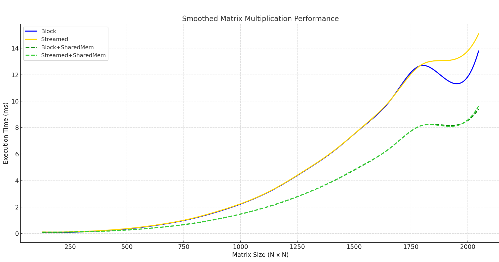

## 🚀 Leveraging Shared Memory for Data Reuse in CUDA

Shared memory in CUDA is a fast, low-latency memory space located on-chip and accessible by all threads in the same block. Unlike global memory, which resides in DRAM and is shared across the entire GPU, shared memory provides much quicker access—typically with latency comparable to register memory. Because of this, it is a powerful tool for optimizing performance in GPU programs.

Each thread block gets its own dedicated shared memory space. Threads in the block cooperatively load a sub-region of matrices **A** and **B** into shared memory and use this data for computation. Synchronization is required to ensure all threads complete their loads before the computation proceeds. Afterward, results are written back to global memory.


---

### 💡 Is Shared Memory Beneficial?

The main benefit of shared memory is speed. Reading from and writing to shared memory is significantly faster than accessing global memory. This is especially important in compute-heavy operations where the same data is accessed repeatedly by different threads. Shared memory enables efficient reuse of data without repeatedly accessing slower global memory, leading to **major performance gains**.

---

### 📊 Benchmark Results

The benchmark results clearly demonstrate the performance benefits of using shared memory in CUDA matrix multiplication kernels. By comparing execution times across four GPU implementations—naive block-based, streamed, and their shared-memory-optimized counterparts—we observe **consistent and substantial speedups** as matrix size increases.

Shared memory significantly enhances the block-based kernel. While the naive block version achieves a 14.76× speedup at size 2048×2048, the shared memory version reaches **21.64×**—an improvement of nearly **50%**. This improvement scales with problem size, showing how shared memory effectively reduces global memory traffic and increases data reuse, making the block kernel far more efficient.



| **Size** | **Block (no SM)** | **Stream (no SM)** | **Block (with SM)** | **Stream (with SM)** | **Speedup Block (no SM)** | **Speedup Stream (no SM)** | **Speedup Block (with SM)** | **Speedup Stream (with SM)** |
|--------:|------------------:|-------------------:|--------------------:|----------------------:|---------------------------:|----------------------------:|------------------------------:|-------------------------------:|
| 128     | 0.10 ms           | 0.12 ms            | 0.09 ms             | 0.11 ms               | 1.18×                     | 0.99×                      | 1.37×                        | 1.05×                         |
| 256     | 0.10 ms           | 0.13 ms            | 0.11 ms             | 0.12 ms               | 5.07×                     | 3.95×                      | 4.84×                        | 4.44×                         |
| 512     | 0.37 ms           | 0.39 ms            | 0.28 ms             | 0.28 ms               | 10.17×                    | 9.60×                      | 13.25×                       | 13.11×                        |
| 1024    | 2.38 ms           | 2.40 ms            | 1.57 ms             | 1.57 ms               | 11.27×                    | 11.18×                     | 17.11×                       | 17.06×                        |
| 1280    | 4.71 ms           | 4.73 ms            | 2.99 ms             | 2.99 ms               | 10.83×                    | 10.78×                     | 17.05×                       | 17.03×                        |
| 1408    | 6.20 ms           | 6.22 ms            | 3.96 ms             | 3.97 ms               | 10.70×                    | 10.66×                     | 16.75×                       | 16.70×                        |
| 1792    | 12.68 ms          | 12.70 ms           | 8.13 ms             | 8.13 ms               | 10.76×                    | 10.75×                     | 16.79×                       | 16.79×                        |
| 2048    | 13.79 ms          | 15.08 ms           | 9.41 ms             | 9.63 ms               | 14.76×                    | 13.50×                     | 21.64×                       | 21.13×                        |


> ⚠️ **Disclaimer Regarding Shared Memory Usage**  
Although modern GPUs offer up to 48KB of shared memory per block, in our implementation we intentionally used a **smaller shared memory footprint**. Empirical testing showed that allocating more shared memory did **not** necessarily improve performance—and sometimes even degraded it. This suggests that performance is influenced more by **tiling strategy and memory reuse efficiency** than by raw memory size.


---

# 📊 Running and Profiling the Matrix Multiplication Implementation

This section explains how to run, profile, and visualize the performance of the different matrix multiplication implementations included in this project. Each script below plays a specific role in benchmarking GPU and CPU performance, generating visual output, and saving logs for analysis.

---

## 🔧 Scripts Overview

| Script                   | Description                                                                 |
|--------------------------|-----------------------------------------------------------------------------|
| `Benchmark.py`           | Benchmarks the current method and show their runtime + speedup data         |
| `GenerateFlameGraph.py`  | Profiles a single implementation and generates a Chrome trace timeline      |
| `ShowPerformance.py`     | Profiles a single implementation and store the data on text file            |
| `script_benchmark_<X>.sh`| Benchmarks the current matmul against the previeus implementation           |                     

---

## 📊 `Benchmark.py`

Benchmarks the current matrix multiplication implementation across multiple matrix sizes.
compare to CPU-based matrix multiplication using Intel MKL and previeus implementation .
**What it does:**
- Runs current implementation
- Measures runtime and calculates speedups.

**Output:**
- `results/times.npy`: Runtimes (ms) for each method and size.
- `results/speedups.npy`: Speedup compared to baseline (e.g., MKL or naive).

**To run:**
```bash
python Benchmark.py
```
---
## 🔥 `GenerateFlameGraph.py`

Profiles a single kernel execution using torch.profiler and generates a Chrome-compatible trace.

Output:

log/profile.json: Timeline that can be loaded into chrome://tracing.

```bash
python GenerateFlameGraph.py
```

## 📄 `ShowPerformance.py`

Profiles a single kernel execution using torch.profiler and store the data on text file.

Output:
Profile.txt

```bash
python ShowPerformance.py
```

## 🧪 `script_benchmark_<X>.sh`
Benchmarks the current matrix multiplication implementation across multiple matrix sizes.
compare to CPU-based matrix multiplication using Intel MKL and previeus implementation .

What it does:

Runs cuurent GPU matrix multiplication across different sizes.

Records runtime and speedups plot to screen.

Output:

**Output:**
- `results/times.npy`: Runtimes (ms) for each method and size.
- `results/speedups.npy`: Speedup compared to baseline (MKL and previeus implementation  ).

```bash
bash script_benchmark_<X>.sh
```

### Previous  : [streaming](/4_Streaming)                           Next  : [Register Tilling](/6_Register_Tilling)    


