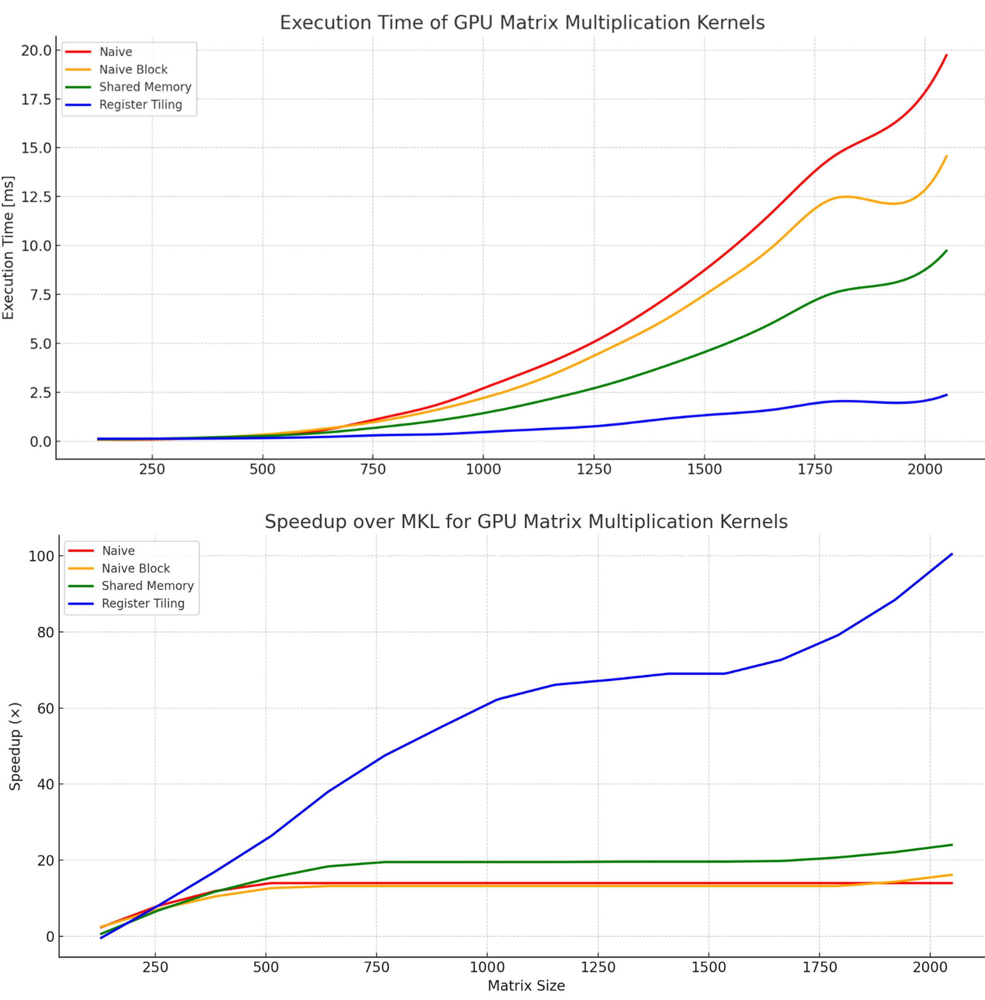

# Accelerating Matrix Multiplication on Nvidia GPU

## 📌 Introduction

This project focuses on optimizing matrix multiplication performance on NVIDIA GPUs using CUDA.  
Matrix multiplication is a fundamental operation in scientific computing and machine learning workloads.  
Optimizing it can significantly improve overall system performance.

To accelerate the computation, we developed a custom CUDA kernel optimized for large matrix sizes.  
The kernel utilizes:

- **Block-Wise Tiling for GPU Parallelism**  
- **Streaming Method**  
- **Leveraging Shared Memory for Data Reuse**
- **Register Tiling for Maximum Throughput**

These techniques reduce global memory traffic and improve data reuse and throughput.

## ⚙️ Problem Definition

Given two input matrices  
**A, B ∈ ℝⁿˣⁿ**, with values in **[-1, 1]**,  
compute their matrix product: C = A × B

Where each element in the result matrix C is computed as: C[i][j] = ∑ A[i][k] * B[k][j]

$C[i][j] = \sum_{k=0}^{N} A[i][k] \cdot B[k][j]$

The implementation aims to compute this efficiently on the GPU using CUDA.

## ✅ Simplifying Assumptions

- **Contiguous Memory:** All matrices are stored contiguously (row-major).
- **Device-Resident:** All input matrices reside in GPU memory. No host-device transfers during computation.
- **FP32 Precision:** All computations are done in 32-bit float (no quantization).
- **No Quantization:** This implementation avoids any form of reduced precision for maximum accuracy.


## 📚 Chronological Progression of GPU Optimizations

This project explores the step-by-step enhancement of matrix multiplication performance through GPU acceleration. We begin by setting a strong CPU baseline and progressively implement and evaluate GPU optimizations. Each step focuses on exposing more parallelism, reducing memory latency, and increasing arithmetic throughput. At every stage, we analyze what improvements were effective and what challenges were encountered, gradually building toward a highly optimized GPU kernel.

- ***Optimized Implementation on CPU (as a Reference Point)*** [Here](1_MKL)

  Establishes a performance baseline using CPU-optimized techniques such as loop unrolling, cache-friendly access patterns, and Intel MKL. This helps quantify speedup from GPU versions.

- ***Naive GPU Implementation (Significant Performance Improvement)*** [Here](2_Naive_GPU_Imp)  

  A simple CUDA kernel that assigns one thread per output element, using global memory directly. While it benefits from massive parallelism, it suffers from poor memory access and no data reuse.

- ***Block-Wise Tiling for GPU Parallelism (Slight Performance Improvement)***  [Here](3_Block_Wise_Tilling)
  
  Divides the matrix into tiles and maps them to thread blocks. This improves coalesced memory access and reduces redundant global memory reads, allowing better GPU occupancy.

- ***Streaming (No Significant Change in Performance – used mainly for debug and analysis)***  [Here](4_Streaming)
       
  Introduces multiple CUDA streams to overlap data transfers and compute with kernel execution, helping hide memory latency and improve throughput.

- ***Leveraging Shared Memory for Data Reuse (Significant Performance Improvement)*** [Here](5_Shared_Memory)
   
  Copies tiles of input matrices into fast shared memory, allowing threads to reuse data multiple times and drastically reduce global memory traffic. This improves bandwidth efficiency.

- ***Register Tiling for Maximum Throughput (Significant Performance Improvement)***  [Here](6_Register_Tilling)
  
  Each thread computes a small output sub-block using registers. This minimizes memory access and leverages low-latency register files for peak arithmetic throughput.

## 📈 Benchmark Results

Compared to Intel MKL and Our Castum CUDA kernel:
- Achieved **~100× speedup over MKL** on 2048×2048 FP32 matrices.
- Significant improvements over naive CUDA by optimizing memory access patterns and thread workloads.



| **Matrix Size** | **MKL (ms)** | **Naive (ms)** | **Naive Block (ms)** | **Shared Memory (ms)** | **Register Tiling (ms)** | **Speedup Naive** | **Speedup NaiveBlk** | **Speedup SharedMem** | **Speedup RegTile** |
|:---------------:|:------------:|:--------------:|:---------------------:|:-----------------------:|:-------------------------:|:-----------------:|:---------------------:|:----------------------:|:---------------------:|
| 128  | 0.17 | 0.12 | 0.08 | 0.10 | 0.08 | 1.43× | 2.03× | 1.72× | 2.07× |
| 256  | 0.63 | 0.11 | 0.09 | 0.11 | 0.08 | 5.57× | 7.22× | 5.53× | 7.90× |
| 384  | 1.96 | 0.20 | 0.18 | 0.19 | 0.10 | 9.68× | 10.77× | 10.14× | 19.51× |
| 512  | 4.16 | 0.34 | 0.35 | 0.27 | 0.12 | 12.23× | 11.95× | 15.49× | 34.93× |
| 640  | 8.16 | 0.61 | 0.63 | 0.43 | 0.17 | 13.45× | 13.02× | 19.13× | 47.12× |
| 768  | 13.64 | 1.20 | 1.03 | 0.71 | 0.26 | 11.41× | 13.24× | 19.20× | 51.66× |
| 896  | 20.23 | 1.90 | 1.61 | 1.05 | 0.32 | 10.66× | 12.59× | 19.25× | 62.91× |
| 1024 | 31.39 | 2.99 | 2.36 | 1.53 | 0.46 | 10.50× | 13.29× | 20.58× | 68.39× |
| 1152 | 41.12 | 4.07 | 3.36 | 2.16 | 0.60 | 10.10× | 12.22× | 19.08× | 68.17× |
| 1280 | 57.45 | 5.48 | 4.69 | 2.89 | 0.78 | 10.48× | 12.26× | 19.91× | 74.03× |
| 1408 | 72.76 | 7.28 | 6.17 | 3.81 | 1.08 | 9.99× | 11.80× | 19.10× | 67.37× |
| 1536 | 95.89 | 9.40 | 8.01 | 4.84 | 1.35 | 10.20× | 11.97× | 19.81× | 71.03× |
| 1664 | 118.59 | 11.97 | 10.14 | 6.14 | 1.57 | 9.91× | 11.70× | 19.30× | 75.35× |
| 1792 | 153.10 | 14.13 | 12.03 | 7.35 | 1.94 | 10.84× | 12.73× | 20.83× | 78.97× |
| 1920 | 184.25 | 19.66 | 15.71 | 9.36 | 2.51 | 9.37× | 11.73× | 19.68× | 73.49× |
| 2048 | 232.27 | 19.09 | 17.71 | 9.52 | 2.44 | 12.17× | 13.11× | 24.39× | 95.35× |

---
## 🚀Future Work: Potential Advanced GPU Optimizations


- ***Double Buffering in Shared Memory (Validated but Not Fully Integrated Yet)***
  
    Overlap computation and memory loading to hide latency and improve pipeline efficiency.

- ***Vectorized Data Loads & Stores (Validated but Not Fully Integrated Yet)***
  
    Use vectorized memory instructions to reduce global memory transactions.

- ***Quantization for Faster Integer GEMM (Partly Validated on Small Matrices )***
  
    Convert floating-point computations to lower-precision formats like int8 or float16

- ***Full Utilization of All 68 SMs (Validated but Not Fully Integrated Yet)***
  
    Scale the kernel launch configuration to engage the entire GPU for maximum throughput.

- ***Improved Streaming Mechanism (Partly Validated on Large Matrices )***
  
    Optimize CUDA streams and data partitioning to increase concurrency and reduce idle time.  


---


## 🖥️ Requirements & Install
- CUDA-enabled NVIDIA GPU (e.g., RTX 2080 Ti)
- Python + PyTorch (with CUDA support)
- C++/CUDA build environment (`nvcc`, `setuptools`)

**(1) Recommended:** Install mamba as in: [https://github.com/conda-forge/miniforge#mambaforge](https://github.com/conda-forge/miniforge#mambaforge).  
If you prefer to use conda, proceed to (2) and replace "mamba" commands with "conda" commands.

**(1.1) First remove any previous Anaconda/miniconda installation via:**
```sh
conda activate base
conda/mamba install anaconda-clean
anaconda-clean --yes
rm -rf ~/miniconda3
rm -rf ~/miniforge3
rm -rf ~/anaconda3
rm -rf ~/.anaconda_backup
```

**(1.2) Install mamba as in:** [https://github.com/conda-forge/miniforge#mambaforge](https://github.com/conda-forge/miniforge#mambaforge)
```sh
curl -L -O "https://github.com/conda-forge/miniforge/releases/latest/download/Miniforge3-Linux-x86_64.sh"
bash Miniforge3-Linux-x86_64.sh
conda config --set auto_activate_base false
```

**(2) Install MMUL_proj environment:**
```sh
mamba create -n MMUL_proj
mamba activate MMUL_proj
mamba install python==3.10.2 pytorch==2.0.1 torchvision==0.15.2 torchaudio==2.0.2 pytorch-cuda=11.7 libgcc-ng==9.5.0 ninja==1.10.2 setuptools==69.5.1 mkl=2024.0.0 cuda-compiler=11.7 cuda-version=11.7 cuda-nvprune=11.7 cuda-cuxxfilt=11.7 cuda-nvcc=11.7 cuda-cuobjdump=11.7 cuda-cudart-dev=11.7 cuda-cccl=11.7 cuda-nvrtc-dev=11.7 cuda-libraries-dev=11.7 -c pytorch -c nvidia
```
## 🧪 Get a GPU and Check Validity

If you are working on a cluster, you can request a GPU and start a shell session using:

```sh
srun -c 2 --gres=gpu:1 --pty bash
```

To verify your GPU is available and CUDA drivers are working, run:

```sh
nvidia-smi
```

You should see details about your GPU.  


For further validation in Python, run:

```python
import torch
print("CUDA available:", torch.cuda.is_available())
print("GPU name:", torch.cuda.get_device_name(0) if torch.cuda.is_available() else "No GPU detected")
```
## ⚡ Compile Extension of Our Implementation (Must):

Enter MMUL_proj environment:
```sh
mamba activate MMUL_proj
```
To install the extension locally, run the following command:
```sh
python setup.py install
```
